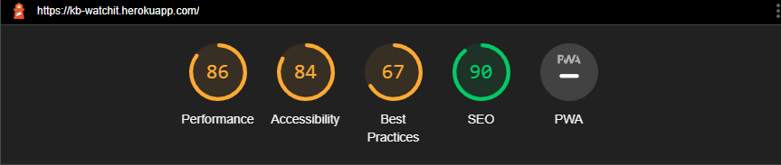

<a href="https://kb-watchit.herokuapp.com/"><h1>Watch It </h1></a>

## Contents
<ul>
    <li>
        <a href="#Introduction"><strong>Introduction</strong></a>
    </li>
    <li>
        <a href="#UX"><strong>UX</strong></a>               
    </li>
    <li>
        <a href="#UX"><strong>Design</strong></a>               
    </li>
    <li>
        <a href="#Technologies"><strong>Technologies</strong></a>
    </li>
    <li>
        <a href="#Features"><strong>Features</strong></a>
    </li>
    <li>
        <a href="#Deployment"><strong>Deployment</strong></a>
    </li>
    <li>
       <a href="#Credits"><strong>Credits</strong></a> 
    </li>
    <li>
        <a href="#Acknowledgements"><strong>Acknowledgements</strong></a>
    </li>
</ul>

## Introduction

Portfolio Project 4: Full Stack Frameworks - Code Institue - Deadline 28th January 2022

This is my sumission for CodeInstitue's Project Portfolio Four. It uses various technologies such as Python, HTML, CSS, Javascript aswell as Django and ElephantSQL which was recently changed as Heroku had changed their terms.  I created this site as I was interested in movies as well as finding new ones to watch as sometimes browsing through the main providers take too long and have no ability to see if people have liked the movie or not.

### Demo
A live of the website can be found <a href="https://kb-watchit.herokuapp.com/"><strong>HERE</strong></a> 

## UX

As many now rely on the internet to browse and access services, UX has become increasingly important than before.

## Design

#### Colours
As many now rely on the internet to browse and access services, UX has become increasingly important than before.

The color scheme is kept simple by only having 3 colors. White (#FFFFFF), Black, (#000000) and Baby Blue (#34A5EB). 
I've opted for a combination of black text set on the white background, with the cta buttons being highlighted and underlined black. 
Along with this the baby blue is used to highlight the navbar, 3 main info points as well as the footer.

#### Imagery

All imagery uploaded is related to movies, from the first image being a camera to the actual movie posters which have been uploaded by users.

## Wireframes

Home

Movie Details

Edit Movie Recommendation 

Register

## Strategy

### Aims

<ol>
  <li>To allow the opportunity for users to create a post of a movie the completely recommend to others</li>
  <li>To allow un-logged in users to browse through posts and find a movie they may potentially watch</li>
  <li>To allow users logged in to like posts and visualise the amount of likes on a particular movie</li>
  <li>To allow users both logged in and out to create a comment on a post to mention why they particually liked the movie</li>
  <li>To allow users to create a profile to enable them to post a movie</li>
  <li>To allow users to create a profile page with social links and bio to make it more personable</li>
</ol>

### Target Audience(s)

<ol>
  <li>Users who are interested in watching movies</li>
  <li>Users who like to read and would like to review a synopsis of a movie prior to watching</li>
</ol>

### User Stories
<ol>
 <li>As a user I can view the movies recently added whilst not needing to log in</li>
 <li>As a user I can view each movie more in depth by clicking on it as I may want to read the synopsis prior to committing to watch the movie</li>
 <li>As a user I can create a profile to be able to post movies I personally like for others to enjoy</li>
 <li>As a user I can create a profile page and include my social media links</li>
 <li>As a user I can comment on a post in order to tell other users if I like a movie or not</li>
 <li>As a user I can like a movie in order to let other users know that a particular movie was liked</li>
 <li>As a user I can delete my own posts in case I change my mind about a specific movie</li>
 <li>As a user I can edit my own posts in case I change my mind about a specific movie or perhaps have left out detail or want to upload a new movie poster</li>
 <li>As a user I can create an account</li>
 <li>As a user I can edit the settings on my account in case I need a password reset</li>
 </ol>

 ### Scope
 It is sometimes more beneficial to develop a website based on the MMP (Minimum Marketable Product). Although unfortuantely as this project requires more advanced concepts aswell as possible time constrains, it may be the case that a MVP (Minimum Viable Product) be created instead. This will allow the basic functions of the website to be implemented whereby time can be more spent on the basics rather than features that our users may potentially never look at.

 Whilst using the MVP
 <ul>
 <li>We will create a clear and consise website that will have all the necessary features needed for such a site.</li>
 <li>We will create a site with minimum levels of UX whilst still being intuitive enough for our users.</li>
 <li>We will meet the requirements of our beloved users</li>
 </ul>

 Whilst following the MVP model, to meet the user and business goals, our website will include:
 <ul>
 <li>A nav-bar that underlines the specific text currently on in order to enable users to identify where they are to be</li>
 <li>Links to the associated social media pages of the organization</li>
 <li>A registration form in order for users to sign up to the site.</li>
 <li>An add movie form in order for the users to provide their movie recommendations</li>
 <li>An edit movie form in case the user would like to edit anything in particular on the movie posted</li>
 </ul>

### Structure of Pages
 
The page created is structured in a way which is easy recognizable to other web pages in the way it has a navigation bar on the top of the page and a footer at the bottom of the home.html. The navaigation bar is duplicated in each page so that it is easy to navigate to other pages from the main home page. On this, the site it divided up into multiple pages which each own having a function.

<ul>
 <li>Home: This is the main page where you will find the most recent posts that have been made/posted by other users. Here you will also find the nav bar and footer as well as the frequently asked questions.</li>
 <li>Registration: This is where users will find themselves creating an account to be able to post movie recommendations</li>
 <li>Add Movie: This, once user is logged in allows them to create movie recommendations with the ability to edit the synopsis as well as the image that will be see in the home page.</li>
 <li>Edit Movie: This, once user is logged in and is the correct user that has created the movie post, will be able to delete, edit the content as well as change the image shown in the home.html file</li>
 To add to this there are various files such as login, changepassword, edit-profile-page and more which enables the user to make their account their own and personalize.
</ul>

## Features
### Implemented Features
<ul>
 <li>Registration Page: Allows users to create a user</li>
 
 <li>nav-bar: Enables users to navigate around the site easier and in an intuitive way</li>
 
 <li>Edit Movie Page: Allows logged in users to edit the post that they have made</li>
 
 <li>FAQ: Allows users a quick look into the frequently asked questions and their answers</li>
  
 <li>Edit Profile Page: Allows users to create their own profile page which makes the experience more personable</li>
  
 <li>Movie Detail Page: Allows users to view the movie as well as the synopsis written by the user who has posted said movie</li>
 
 <li>Comment, Like and Profile Page: Allows users to like, comment and view the profile page of the user that created the movie post</li>
 
</ul>

## Admin Panel/Superuser
On the Admin Panel, as an admin/superuser I have full access to CRUD functionality so I can view, create, edit and
delete the following ones:

<ol>
    <li>Users</li>
    <li>Categorys</li>
    <li>Comments</li>
    <li>Posts</li>
    <li>Profiles</li>
</ol>

## Technologies

- [HTML 5](https://en.wikipedia.org/wiki/HTML/)
- [CSS 3](https://en.wikipedia.org/wiki/CSS)
- [JavaScript](https://www.javascript.com/)
- [Django](https://www.python.org/)
- [Python](https://www.djangoproject.com/)

## Frameworks & Tools & Programs Used
- [Bootstrap](https://getbootstrap.com/) 
   Was used to style the website, add responsiveness and interactivity
- [Jquery](https://jquery.com/) 
   All the scripts were written using jquery library
- [Git](https://git-scm.com/) 
   Git was used for version control by utilizing the Gitpod terminal to commit to Git and push to GitHub
- [GitHub](https://github.com/) 
   GitHub is used to store the project's code after being pushed from Git
- [Heroku](https://id.heroku.com) 
   Heroku was used to deploy the live project
- [PostgreSQL](https://www.elephantsql.com/) 
   Database used through heroku.
- [VSCode](https://code.visualstudio.com/) 
   VSCode was used to create and edit the website
- [Lucidchart](https://lucid.app/) 
   Lucidchart was used to create the database diagram
- [PEP8](http://pep8online.com/) 
   PEP8 was used to validate all the Python code
- [W3C - HTML](https://validator.w3.org/) 
   W3C- HTML was used to validate all the HTML code
- [W3C - CSS](https://jigsaw.w3.org/css-validator/) 
   W3C - CSS was used to validate the CSS code
- [Fontawesome](https://fontawesome.com/) 
   To add icons to the website
- [Google Chrome Dev Tools](https://developer.chrome.com/docs/devtools/) 
   To check App responsiveness and debugging
- [Cloud Convert](https://cloudconvert.com/jpg-to-webp) 
   To change formatting of images to WEBP
- [Balsamiq](https://balsamiq.com/) 
   To build the wireframes for the project
- [Adobe Color Wheel](https://color.adobe.com/create/color-wheel) 
   To build the colour palette of the project

## Creating the Django app
<ol>
  <li>Go to the Code Institute Gitpod Full Template <a href="https://github.com/Code-Institute-Org/gitpod-full-template">Template</a>.</li>
  <li>Click on "Use This Template".</li>
  <li>Once the template is available in your repository, click on "Gitpod".</li>
  <li>When the image for the template and the Gitpod are ready, open a new terminal to start a new Django App.</li>
  <li>Install Django and gunicorn: <code>pip3 install django gunicorn</code>.</li>
  <li>Install supporting database libraries dj_database_url and psycopg2 library: <code>pip3 install dj_database_url psycopg2</code>.</li>
  <li>Create file for requirements: in the terminal window, type <code>pip freeze --local &gt; requirements.txt</code>.</li>
  <li>Create project: in the terminal window, type <code>django-admin startproject your_project_name</code>.</li>
  <li>Create app: in the terminal window, type <code>python3 manage.py startapp your_app_name</code>.</li>
  <li>Add app to the list of installed apps in settings.py file: <code>you_app_name</code>.</li>
  <li>Migrate changes: in the terminal window, type <code>python3 manage.py migrate</code>.</li>
  <li>Run the server to test if the app is installed, in the terminal window, type <code>python3 manage.py runserver</code>.</li>
  <li>If the app has been installed correctly, the window will display "The install worked successfully! Congratulations!".</li>
</ol>

### Features left to implement
<ul>
 <li>Categories for the Movies as they are currently bunched up in the home.html file</li>
  <li>Allow users to add favorites rather than browsing through the movies posts</li>
</ul>

## Performance
Below is the report generated from lighthouse via Chrome DevTools for the Desktop website. Whilst this could be better, precautions I have taken have been to convert images to WEBP to enable a fast load time. Though I don't doubt there there are further changes that need to be made to maximize this. 

## Deployment
A live demo of the website can be found <a href="https://kb-watchit.herokuapp.com/" target="_blank">**HERE**</a> 
<ol>
    <li>A new repository was created using 'Code-Instutute-Org/gitpod-full-template'</li>
    <li>A meaningful name was given to the new repository and 'Create Repository' was selected</li>
    <li>The repository was then opened on GitHub by clicking the 'Gitpod' button to build the GitPod workspace which would allow me to build and edit the code used to make the <em>Project Name</em> website/application</li>
    <li>Version control was used throughout the project using the following commands in the terminal.
        <ul>
            <li>git add . <strong>OR</strong> git add "file name" - to stage the changes and get them ready for being committed to the local repo.</li> 
            <li>git commit -m "small description of update" - to save the change and commit the change to the local repo</li>
            <li>git push - to push all committed changes to the GitHub repo associated with the GitPod workspace</li>
        </ul>
    </li>
</ol>

### Project Deployment
This project was deployed via Heroku by carrying out the following:
<ol>
    <li>Create the gitpod repo from the template via the gitpod button in github.</li>
    <li>Log in to Heroku and create a new app. Or you can create new app within the terminal</li>
    <li>Create ElephantSQL Account and use url details to link app and database together</li>
    <li>Complete the config vars section</li>
    <li>Link Heroku and GitHub accounts together</li>
    <li>Select the repo (via Heroku) that you want to make an app of and give it a name in Heroku.</li>
    <li>Click on deploy.</li>
</ol>

## Forking This Project
Fork this project by following the steps:
<ol>
    <li>1. Open GitHub<a href="https://github.com/KeithBautista/watch-it" target="_blank"></li>
    <li>2. Find the 'Fork' button at the top right of the page</li>
    <li>Once you click the button the fork will be in your repository</li>
</ol>

## Credits
### Code
All code used in this project was taken from the Code Institute lessons, as well as Django's documentation.

# Acknowledgements
This website, Watch It was designed and developed in conjunction with the Full Stack Developer Diploma course with specialty in ecommerce at Code Institute. I would like to thank Code Institute as well as the content creators in youtube for Django specifically for getting me through this! More Specifically John Elder with his Django course on Blog Posts.