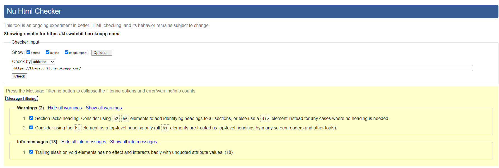
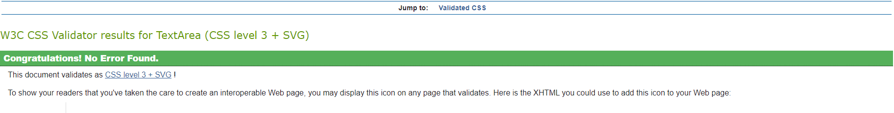

# Testing
Back to the [README](README.md)

* Continuous testing has been conducted throughout the project's development. Each view was regularly tested, and debugging occurred at any point where the outcome did not meet expectations.

## Python Validation - PEP8
* To ensure there were no syntax errors in the project, Python testing was performed using PEP8 Online. All Python files were entered into the online checker, and no errors were found in any of the custom codes.

#### Watch It - members
* [admin.py](readmeassets/extras/members/admin.png)
* [apps.py](readmeassets/extras/members/apps.png)
* [models.py](readmeassets/extras/members/models.png)
* [forms.py](readmeassets/extras/members/forms.png)
* [urls.py](readmeassets/extras/members/urls.png)
* [views.py](readmeassets/extras/members/views.png)

#### Watch It - watchit
* [admin.py](readmeassets/extras/watchit/admin.png)
* [apps.py](readmeassets/extras/watchit/apps.png)
* [models.py](readmeassets/extras/watchit/models.png)
* [forms.py](readmeassets/extras/watchit/forms.png)
* [urls.py](readmeassets/extras/watchit/urls.png)
* [views.py](readmeassets/extras/watchit/views.png)

#### Watch It - watch_it
* [asgi.py](readmeassets/extras/watch_it/asgi.png)
* [settings.py](readmeassets/extras/watch_it/settings.png)
* [urls.py](readmeassets/extras/watch_it/urls.png)
* [wsgi.py](readmeassets/extras/watch_it/wsgi.png)

## Performance

Below is the report generated from lighthouse via Chrome DevTools for the Desktop website. Whilst this could be better, precautions I have taken have been to convert images to WEBP to enable a fast load time. Though I don't doubt there there are further changes that need to be made to maximize this. 

## HTML Validation
.
* HTML was validated using W3 Validator, whilst there are no errors there are 2 warnings and 18 Info messages present.

## CSS Validation
.

## Backend/Admin Panel
* I have repeatedly tested the Admin Panel since the start of the project's development. All the models are working without issues. I have successfully created, deleted, and updated data in all models without any errors. The models have the expected behavior for which they were built.

## Manual Testing
### Frontend
* The Signup, Login, and Logout system is working correctly and has no issues. It displays the appropriate interactive message to the users.

* The Profile Page is functioning properly. It updates the user's information and uploads/updates the user profile image. Once the update is complete, it shows the interactive message to the user.

* The user profile image in the navbar and Post Details page is working without issues and displays the user's image when it is uploaded on the Profile Page.

* All internal links are functioning correctly and direct the user to the correct page on the website.

* All external links are working correctly and direct the user to the correct social media page by opening a new browser tab.

* The comment form is without issues and submits a new comment once the form is completed by any user.

* On the Movie Page, the CRUD functionality is working without issues. Logged-in users can create a new post such as update or delete their own Movie Posts. Also, any post can be updated or deleted on this page by the Superuser.

### Backend/Admin Panel
* I have repeatedly tested the Admin Panel since the start of the project's development. All the models are working without issues. I have successfully created, deleted, and updated data in all models without any errors. The models have the expected behavior for which they were built.